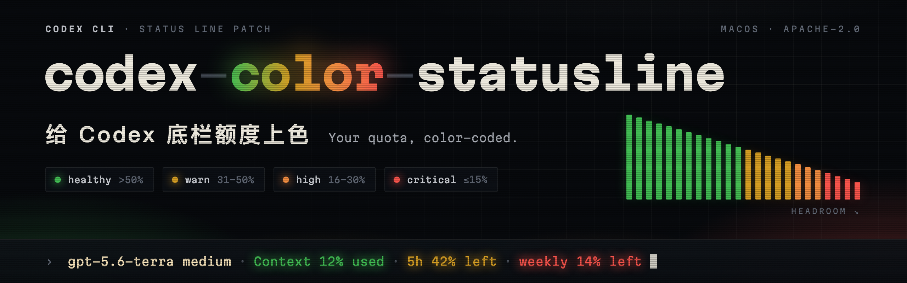
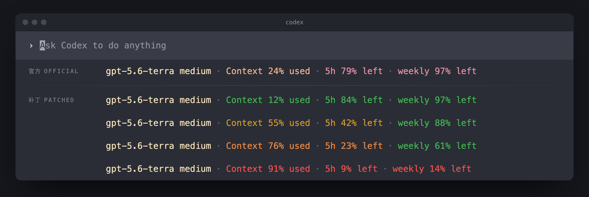

<p align="center">
  
</p>

<p align="center"><a href="README.md">English</a> | <b>中文</b></p>

# codex-color-statusline

给 [OpenAI Codex CLI](https://github.com/openai/codex) 的底栏额度上色：上下文、5 小时额度、每周额度会随着剩余量变少，从绿变黄、变橙、变红。

<p align="center">
  
</p>
<p align="center"><sub>模拟效果图。第一行是官方原配色，下面几行是补丁后在不同用量下的样子。</sub></p>

Codex 底栏本来就能显示 `Context N% used`、`5h N% left`、`weekly N% left`，但颜色只按项目类型固定，额度快用完了颜色也不变，而且没有设置能改。这个项目用官方源码加一个只改一个文件的补丁，重新编译 Codex。

| | 绿 | 黄 | 橙 | 红 |
|---|---|---|---|---|
| 5h / weekly **剩余** | 50% 以上 | 31–50% | 16–30% | 15% 及以下 |
| Context **已用** | 50% 以下 | 50–69% | 70–84% | 85% 及以上 |

两行是同一个标准（已用 = 100 − 剩余）。Context 每个对话单独算；5h 和 weekly 整个账号共用，在 Codex 启动和每轮回复时刷新。

> 非官方项目，与 OpenAI 无关。替换前会先备份官方原版，随时可以还原。

## 需要准备

- macOS，Codex CLI 用官方独立安装包安装（位于 `~/.codex/packages/standalone`）。已在 Apple Silicon + Codex CLI 0.154.0 上测试
- Xcode 命令行工具：`xcode-select --install`
- CMake：`brew install cmake`
- Rust：`curl --proto '=https' --tlsv1.2 -sSf https://sh.rustup.rs | sh`。Codex 指定的 Rust 版本由编译脚本自动安装
- 约 10 GB 空闲磁盘。Apple Silicon 上第一次编译加测试约 30 分钟

## 安装

1. 在 `~/.codex/config.toml` 里打开这几项（底栏已经显示了就跳过）：

   ```toml
   [tui]
   status_line = ["model-with-reasoning", "context-used", "five-hour-limit", "weekly-limit"]
   status_line_use_colors = true
   ```

2. 编译并安装：

   ```bash
   git clone https://github.com/noya21th/codex-color-statusline.git
   cd codex-color-statusline
   ./build.sh     # 按你装的 Codex 版本编译补丁版，并跑测试
   ./install.sh   # 先备份官方原版，再换上补丁版
   ```

3. 重开 Codex。第 2 步之前就开着的窗口还在用旧程序，要关掉重开。

## 卸载

```bash
./uninstall.sh
```

## Codex 升级之后

Codex 升级会装到新的版本目录，底栏会变回官方版（没颜色，不影响使用）。重新运行 `./build.sh && ./install.sh` 即可。如果 `build.sh` 提示补丁套不上，说明上游改了底栏着色代码，补丁需要更新。

## 原理

- `patches/status-line-threshold-colors.patch` 只改 `codex-rs/tui/src/bottom_pane/status_line_style.rs` 一个文件，并附带单元测试。它从四个额度项的文字里读出百分比，读不出来的保持原主题色。
- `build.sh [版本]` 下载对应的 `rust-v<版本>` 源码，打补丁，编译 `codex`，跑补丁测试。源码里 `Cargo.lock` 的工作区 crate 版本是 `0.0.0`，脚本只更新这些条目，第三方依赖有任何变动就停止。
- `install.sh [版本]` 先把官方原版（仅限 OpenAI 签名的）备份到 `~/.cache/codex-color-build/backup/<版本>/`，再用原子改名替换，正在运行的 Codex 不受影响。
- `uninstall.sh [版本]` 核对备份校验值后还原。

源码和编译产物放在 `~/.cache/codex-color-build/`。确认好用后可以删掉里面的 `target` 文件夹，能腾出好几 GB。

## 许可证

[Apache-2.0](LICENSE)，与 Codex 一致。另见 [NOTICE](NOTICE)。
